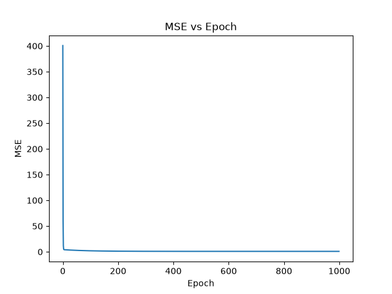
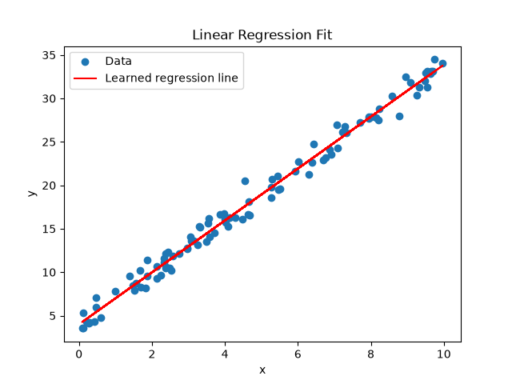
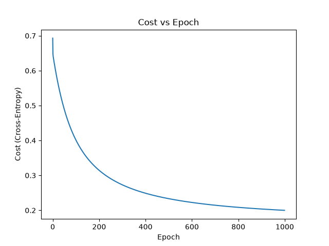
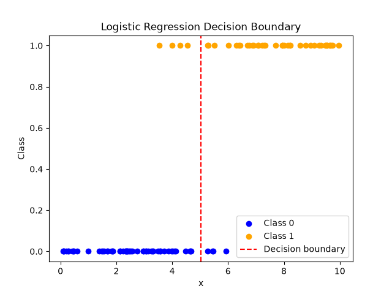

# Healthcare ML

This is a machine learning project built in Python, moving from first-principles implementations through to a research-grade healthcare capstone.

## How it works

**v0 and v0.5 are built entirely from scratch, in NumPy only, no scikit-learn, no PyTorch, no TensorFlow.** Linear regression, logistic regression, and (later) a feedforward neural network are implemented and derived by hand, including the gradient descent update rules. The goal of these two versions is genuine mathematical understanding of what a model is doing, not producing a working result quickly.

From v1 onward, the project moves to standard libraries for applied work, but the from-scratch foundation in v0 and v0.5 means every library call afterward is used with a real understanding of what it's automating underneath.

**v0 specifically** implements simple linear regression, $y = b_0 + b_1 x$, trained with gradient descent implemented entirely by hand; no matrix operations, using explicit loops and manually derived partial derivatives of the cost function $J(b_0, b_1)$. The full derivation of the gradients is written up in [derivation.md](derivation.md).

Synthetic data is generated from a known true relationship ($b_0 = 4$, $b_1 = 3$) plus Gaussian noise, so the model's learned parameters can be checked directly against a known ground truth rather than just visually inspected.

**Logistic regression** extends the same approach to binary classification, passing the linear combination through the sigmoid function $\sigma(z) = \frac{1}{1+e^{-z}}$ and using cross-entropy loss instead of MSE, since MSE doesn't optimise well for classification. Both the sigmoid derivative and the cross-entropy gradients were derived by hand, see [derivation.md](derivation.md) for the full working.

**Verification against scikit-learn (planned).** Both the linear and logistic regression implementations will be checked against scikit-learn's `LinearRegression` and `LogisticRegression` on the same data, to confirm the from-scratch implementations converge to matching parameters.

## v0 Results, Linear Regression (1000 epochs, learning rate 0.01)

| Parameter | True Value | Learned Value |
|-----------|-----------|----------------|
| b0        | 4         | 4.005          |
| b1        | 3         | 2.986          |

## v0 Results, Logistic Regression (1000 epochs, learning rate 0.1)

| Parameter | True Value | Learned Value |
|-----------|-----------|----------------|
| b0        | -7.5      | *(fill in from your output)*  |
| b1        | 1.5       | *(fill in from your output)*  |

## Observations

**v0 Observations, Linear Regression**

The model converges very quickly, MSE drops sharply within roughly the first 100 epochs and stays flat for the remaining 900, suggesting this particular problem could likely converge with significantly fewer epochs than the 1000 used here.

Both learned parameters land close to their true values (b0 within 0.005, b1 within 0.014), confirming the from-scratch gradient descent implementation is correctly finding the underlying relationship despite the added noise.

**v0 Observations, Logistic Regression**

The decision boundary lands almost exactly where the true parameters place it, with only a small number of points near the boundary misclassified, expected given the probabilistic overlap between classes so close to the 50/50 point.

The cost curve converges more slowly than linear regression's MSE did, still visibly decreasing, if only slightly, by epoch 1000, rather than fully flattening out by epoch 100 to 200. Worth investigating further whether more epochs or a different learning rate would close this gap.

## How to run

pip install numpy matplotlib

python main.py

## What's next

- Verify both linear and logistic regression against scikit-learn's implementations
- v0.5: from-scratch feedforward neural network with backpropagation, NumPy only
- v1a: tabular classification (UCI Heart Disease or Wisconsin Breast Cancer)
- v1b: CNN-based image classification (diabetic retinopathy or skin lesion data)
- v2: ICU mortality/sepsis prediction from PhysioNet Challenge data